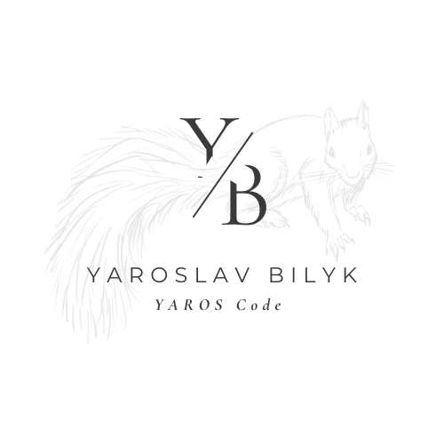

## Hi, I'm Yaroslav Bilyk 👋

  

### Cybersecurity Analyst 🛡️ | Full-Stack Developer 💻 | Law Expert ⚖️

Merging **cybercrime investigation** experience from the Prosecutor General's Office of the Ukraine with **software engineering** to build secure, semantic, and efficient digital solutions.

---

### 🛠️ Tech Stack:

---

### 🚀 About Me:

- 🛡️ **Cybersecurity Analyst:** Countering cybercrimes at the Office of the Prosecutor General.
- 💻 **Full-Stack Developer:** Building robust applications using the MERN stack (JavaScript, React, Node.js, Next.js).
- 🎓 **GoIT Graduate:** Completed intensive FullStack development training.
- ⚖️ **Academic Background:** Master of Laws (KNEU) and Master of Public Administration (NAPA).

---

### 📫 Connect with me:

---

*"Coding with legal precision and security as a priority."*

